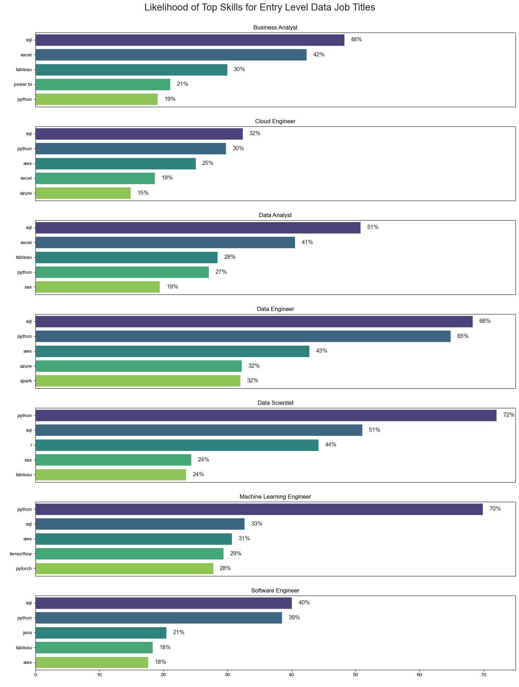

# The Analysis
## What are the most demanded skills for the top non-Senior level data roles in the US?

To identify the most in-demand skills for popular non-Senior level data-related roles, I filtered out the most popular positions and determined the top 5 skills for each. This analysis highlights the key job titles and their essential skills, helping me focus on the relevant skills for my targeted role.


To view my notebook with detailed steps, click here: [2_Skills_Demand.ipynb](Python_Data_Project/3_Project/2_Skills_Demand.ipynb)

### Data Visualization and Results

```python
fig, ax = plt.subplots(len(job_titles), 1, figsize=(15, 20))
sns.set_theme(style='ticks')
for i, job_title in enumerate(job_titles):
    df_plot = df_skills_perc[df_skills_perc['job_title_short'] == job_title].head(5).copy()
    sns.barplot(x='skill_perc', y='job_skills', data=df_plot, ax=ax[i], hue='job_skills', palette='viridis')
    ax[i].set_title(job_title)
    ax[i].set_xlabel(' ')
    ax[i].set_ylabel(' ')
    ax[i].set_xlim(0, 75)

    for n, value in enumerate(df_plot['skill_perc']):
        ax[i].text(value + 1, n, f'{value:.0f}%', va='center')

    if i != len(job_titles) - 1:
        ax[i].set_xticks([])

plt.suptitle('Likelihood of Top Skills for Non-Senior Data Job Titles', fontsize=20, ha='center')
plt.tight_layout(rect=[0, 0, 1, 0.98])
plt.show()
```


*Bar graphs showing the percentages of top 5 skills for the top most common data roles in the US*

### Insights

1. **SQL**:
   - **High Demand Across All Roles**: SQL is a critical skill for all positions, with the highest demand in Data Engineer (68%) and Data Analyst (51%). Even roles like Business Analyst (48%) and Cloud Engineer (32%) show a significant need.
   - **Key Insight**: Mastery of SQL is essential for any data-related role, highlighting its importance across various functions.

2. **Python**:
   - **Critical for Technical Roles**: Python is especially crucial for Data Scientist (72%), Machine Learning Engineer (70%), and Data Engineer (65%). It's also important for Data Analyst (27%) and Cloud Engineer (30%).
   - **Key Insight**: Python is a foundational programming language for technical roles, particularly those involving advanced analytics and engineering.

3. **Excel**:
   - **Essential for Business-Focused Roles**: Excel is a top skill for Business Analyst (42%) and Data Analyst (41%). It also appears in Cloud Engineer (19%).
   - **Key Insight**: Proficiency in Excel is particularly valuable for roles that require data manipulation and reporting.

4. **Tableau**:
   - **Important for Visualization**: Tableau is a key skill for Business Analyst (30%), Data Analyst (28%), and Data Scientist (24%).
   - **Key Insight**: Tableau is a sought-after tool for data visualization, necessary for roles that require presenting data insights.

5. **AWS**:
   - **Vital for Cloud and Engineering Roles**: AWS is highly relevant for Cloud Engineer (25%), Data Engineer (43%), and Machine Learning Engineer (31%).
   - **Key Insight**: AWS expertise is critical for roles involving cloud services and infrastructure.

6. **Other Notable Skills**:
   - **Power BI**: Important for Business Analyst (21%).
   - **R**: Relevant for Data Scientist (44%).
   - **SAS**: Useful for Data Analyst (19%) and Data Scientist (24%).
   - **Azure**: Significant for Cloud Engineer (15%) and Data Engineer (32%).
   - **Spark**: Important for Data Engineer (32%).
   - **Java**: Necessary for Software Engineer (21%).
   - **TensorFlow and PyTorch**: Key for Machine Learning Engineer (29% and 28%, respectively).

### Summary
- **Core Skills**: SQL and Python are the most universally demanded skills across multiple roles.
- **Role-Specific Skills**:
  - **Business and Analytical Roles**: Emphasize Excel and Tableau.
  - **Technical and Engineering Roles**: Focus on AWS, Azure, Spark, and specific programming frameworks like TensorFlow and PyTorch.
- **Visualization Tools**: Tableau is essential for roles that require data presentation.

By mastering these common and role-specific skills, individuals can enhance their job security and versatility in the job market. The overlap of critical skills like SQL and Python across multiple roles ensures that professionals remain competitive and adaptable, while proficiency in specialized tools like Excel, Tableau, and AWS can provide an edge in specific positions. This comprehensive skill set not only prepares individuals for a variety of data job titles but also offers greater stability and growth opportunities in their careers.

---

## How are in-demand skills trending for Top 3 Data-Related Jobs?

To identify trends in data-specific roles, I analyzed the top three in-demand positions and pinpointed the top five skills for each. I then plotted the monthly percentage of job listings requiring these skills. This analysis highlights the consistency of these top skills across the industry, underscoring their importance for robust career stability and adaptability in various roles.

To view my notebook with detailed steps, click here: [3_Skills_Trend.ipynb](Python_Data_Project/3_Project/3_Skills_Trend.ipynb)

### Data Visualization and Results
```python
df_plot = df_DA_US_perc.iloc[:, :5]
sns.lineplot(data=df_plot, dashes=False, palette='tab10')
sns.set_style('ticks')
plt.title('Probability of Data Skills Over Time in the US (Data Analyst, Data Scientist, Data Engineer)')
plt.xlabel('2023')
plt.ylabel('Probability of Job Skill (%)')

# Fixing the legend
plt.legend(loc='center left', bbox_to_anchor=(1, 0.5))

# Adding percentage to y-axis
from matplotlib.ticker import PercentFormatter
ax = plt.gca()
ax.yaxis.set_major_formatter(PercentFormatter(decimals=0))
```


*Line graph showing overall the probability of each of the top skills appearing in job posts on month-to-month basis*

### Insights

1. **SQL Dominance**:
   - **Consistent High Demand**: SQL remains the most demanded skill throughout the year, maintaining a probability around 55%.
   - **Key Insight**: SQL is a stable and essential skill for data roles such as Data Analyst, Data Scientist, and Data Engineer.

2. **Python Popularity**:
   - **Sustained High Demand**: Python consistently shows a high probability, around 50%, indicating its crucial role across these positions.
   - **Key Insight**: Python is indispensable for technical data roles, emphasizing the need for proficiency in this language.

3. **R Steady Presence**:
   - **Moderate Demand**: The probability of R skills fluctuates around 25%, with a slight peak in late summer.
   - **Key Insight**: While not as dominant as SQL or Python, R remains a valuable skill, especially for roles focusing on statistical analysis.

4. **Tableau Demand Fluctuations**:
   - **Slight Variation**: Tableau's probability remains close to 20% but shows minor fluctuations throughout the year.
   - **Key Insight**: Tableau is important for data visualization roles, though its demand is relatively stable with some variation.

5. **Excel Consistency**:
   - **Low but Steady Demand**: Excel's probability stays consistently around 20%, indicating its steady presence in data roles.
   - **Key Insight**: Excel continues to be a fundamental skill, particularly for data manipulation and reporting tasks.

### Summary
- **Core Skills**: SQL and Python are consistently in high demand, reinforcing their importance across various data roles.
- **Supplementary Skills**: R, Tableau, and Excel, while not as dominant, remain valuable and contribute to a well-rounded skill set.
- **Stability and Fluctuation**: The demand for these skills shows overall stability with minor fluctuations, suggesting steady job security for professionals proficient in these areas.

This chart highlights the importance of focusing on SQL and Python for robust career stability, while also acquiring skills in R, Tableau, and Excel to enhance job prospects and adaptability.

### Data Visualization and Results cont'd
```python
# Create subplots
fig, axes = plt.subplots(nrows=len(job_titles), figsize=(7, 15))

for i, title in enumerate(job_titles):
	ax = axes[i]
	
	# Filter the DataFrame for the current job title and country
	df_filtered = df_concat[(df_concat['job_title_short'] == title) & (df_concat['job_country'] == 'United States')].copy()
	
	# Extract the month number from the job posted date
	df_filtered['job_posted_month_no'] = df_filtered['job_posted_date'].dt.month
	
	# Explode the job skills column
	df_filtered = df_filtered.explode('job_skills')
	
	# Create a pivot table
	df_pivot = df_filtered.pivot_table(index='job_posted_month_no', columns='job_skills', aggfunc='size', fill_value=0)
	
	# Calculate the total counts for each skill
	df_pivot.loc['Total'] = df_pivot.sum()
	
	# Sort the pivot table by the total counts
	df_pivot = df_pivot[df_pivot.loc['Total'].sort_values(ascending=False).index]
	
	# Drop the total row
	df_pivot = df_pivot.drop('Total')
	
	# Calculate the total counts for each month
	df_totals = df_filtered.groupby('job_posted_month_no').size()
	
	# Calculate the percentage for each skill
	df_perc = df_pivot.div(df_totals / 100, axis=0)
	
	# Reset the index
	df_perc = df_perc.reset_index()
	
	# Format the month numbers to month names
	df_perc['job_posted_month_no'] = df_perc['job_posted_month_no'].apply(lambda x: pd.to_datetime(str(x), format='%m').strftime('%b'))
	
	# Set the index to the month names
	df_perc = df_perc.set_index('job_posted_month_no')
	
	# Select the top 5 skills
	df_plot = df_perc.iloc[:, :5]
	
	# Plot the data
	sns.lineplot(data=df_plot, dashes=False, palette='tab10', ax=ax)
	sns.set_style('ticks')
	ax.set_title(f'Probability of Data Skills Over Time in the US ({title})')
	ax.set_xlabel('2023')
	ax.set_ylabel('Probability of Job Skill (%)')
	ax.set_ylim(0, 16)
	ax.legend(loc='center left', bbox_to_anchor=(1, 0.5))
	ax.yaxis.set_major_formatter(PercentFormatter(decimals=0))

plt.tight_layout()
plt.show()
```


*Seperate line graphs of each of the top Data Jobs showing the probabilities of the top 5 skills appearing in job posts month by month*

### Insights

#### Data Analyst
- **Core Skills**:
  - **SQL**: Consistently the most demanded skill, around 14%, essential for data querying and management.
  - **Excel**: Steady demand, around 12%, crucial for data manipulation and analysis.
  - **Python**: Stable demand around 8%, important for data analysis and automation.

- **Supplementary Skills**:
  - **Tableau**: Around 7%, vital for data visualization and reporting.
  - **SAS**: Around 6%, used for statistical analysis and data manipulation.

#### Data Scientist
- **Core Skills**:
  - **Python**: Most demanded skill, around 14%, essential for data analysis, machine learning, and statistical modeling.
  - **SQL**: Steady demand, around 12%, important for data querying and manipulation.
  - **R**: Around 8%, critical for statistical analysis and data visualization.

- **Supplementary Skills**:
  - **SAS**: Around 5%, used for advanced statistical analysis.
  - **Tableau**: Around 5%, valuable for data visualization.

#### Data Engineer
- **Core Skills**:
  - **SQL**: Consistently the most demanded skill, around 10%, essential for database management and ETL processes.
  - **Python**: Steady demand, around 8%, important for scripting and automation.
  - **AWS**: Consistent demand around 6%, crucial for cloud-based data solutions.

- **Supplementary Skills**:
  - **Azure**: Around 5%, used for cloud services and data solutions.
  - **Spark**: Around 4%, important for big data processing.

### Shared Skills Across Roles
- **SQL**: Dominates across all three roles, essential for data querying, management, and manipulation.
- **Python**: High demand in all roles, crucial for programming, data analysis, and automation.

### Role-Specific Highlights
- **Data Analysts**: Excel and Tableau are particularly important for data manipulation and visualization.
- **Data Scientists**: R and SAS are significant for statistical analysis and advanced data modeling.
- **Data Engineers**: AWS, Azure, and Spark are key for cloud computing and big data processing.

### Summary
Focusing on mastering SQL and Python provides a robust foundation for career stability and adaptability across Data Analyst, Data Scientist, and Data Engineer roles. Additionally, gaining proficiency in role-specific skills enhances job prospects and versatility in the dynamic field of data science and engineering.